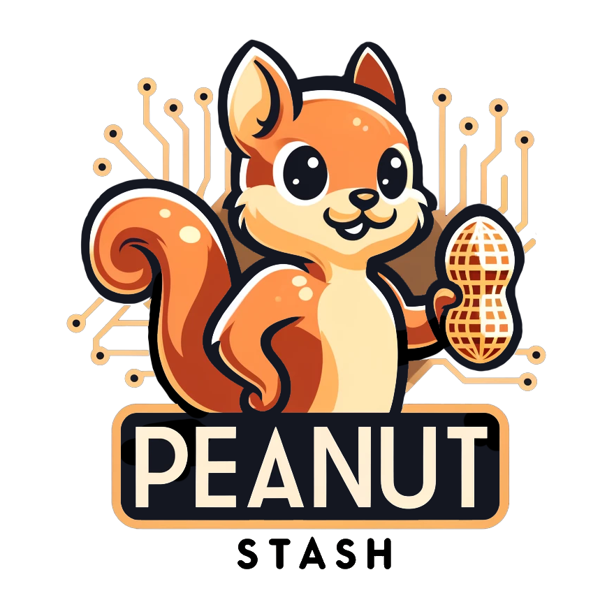
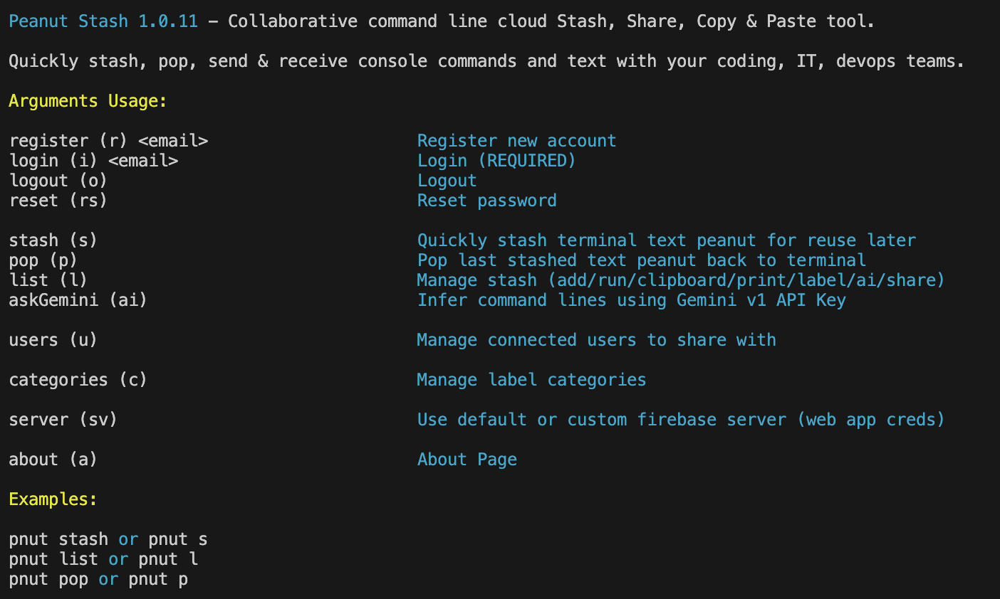

# Peanut Stash 🥜 1.1.0 

<div align="center" width="100%">



</div>

<div align="center" width="100%">


</div>

### Description:
Collaborative command line cloud Stash, Share, Copy & Paste tool.

Quickly stash, pop, run, send & receive console commands and text with your team.
Helpful tiny secure tool for coders, IT and devops who work frequently within the terminal.

Move away from saving your favorite lists of common project/tech terminal commands in a bunch of text files and instead access them quickly in an organized smart fashion from the terminal itself of any computer.

Unlike pastebin and its 3rd party tools/ecosystem, this tool and project is more focused on quick efficient terminal commands stashing/sharing and not on code sharing.





### Requirements:

Nodejs 20+

Firebase project (Optional)

Requires internet connection

### Development Installation:

```sh
npm install
```

Note: to test/work using  your own local firebase emulator server (firebase + authentication)
You have edit config/local-testing-server.env and put your own local emulator IDs

### NPM Installation:

```sh
npm i -g peanut-stash
```
[https://www.npmjs.com/package/peanut-stash](https://www.npmjs.com/package/peanut-stash)

###  Command:

```sh
pnut
```
### Arguments Usage:

    register (r) <email>                     Register new account
    login (i) <email>                        Login  (REQUIRED)
    logout (o)                               Logout
    reset (rs)                               Reset password
  
    stash (s)                                Quickly stash terminal text peanuts 🥜 for reuse later
    pop (p)                                  Pop last stashed text peanut 🥜 back to terminal
    list (l)                                 Manage 🥜 stash (add/run/clipboard/print/label/ai/share)
    alias (a)                                Shortcut name to stashed command to run (optional params)
    gemini (ai)                              Setup/Infer commands with Gemini v1 API (paid/free)

    users (u)                                Manage connected users to share with

    categories (c)                           Manage label categories

    server (sv)                              Use default or custom firebase server (web app creds)

    about (a)                                About Page

### Examples:

    pnut stash  

(or shorthand) 
    pnut s 
(then type or paste your terminal text, ie : adb shell pm list packages -e) 

    pnut list
(or shorthand) 
    pnut l
(forward/use/delete/copy/ai..)

    pnut pop
(or shorthand) 
    pnut p
(get the last stashed text peanut)

    pnut a lst ~/project1
(stashed command alias title to run would be 'lst' and the command template would be 'ls -al ${folder}' )

### Features:

* Cloud based collaborative copy pasting of terminal commands (peanuts! 🥜)
* Requires an account with email verification
* Ready out of the box to try out
* Access your stash of terminal commands anywhere you login
* Stash, pop, execute, categorise, clipboard copy, ask ai, edit, share commands quickly with colleagues
* Run quick alias shortcuts from the terminal that map to full length commands/templates with optional variables 
* Open links in browser from terminal console
* Attach notes to stashed peanut texts to remind you what the commands do and add context
* Manage cloud users to share text peanut with
* Manage category labels to filter/organize your text peanut commands
* Simple cloud design requires no server logic/functions/api endpoints
* Default public testing server available with the project (read below notes)
* Supports private custom servers with easy quick setup
* Works on firebase free spark plan or blaze, you just need realtime DB and Auth with email enabled
* RSA used to secure encryption of peanut texts
* Symmetrical encryption for login credentials based on machine signatures
* Color codded interactive prompts
* Firebase realtime db security rules for autherization and access control of data
* Integration with Gemini V1 API (Free/paid keys required) to help create, find & explain command lines using natural language
* Export single commands or entire collections to unlisted pastebin URLs (key required)

### Config & troubleshooting

Peanut stash saves under ~/.peanuts its configuration files (login, ai key, pastebin and custom server)
In case of issues, such as using wrong custom server config, you can remove those files to reset them.

### Important Notes:

Currently the app when installed runs by default on a public testing server, so no need to set one up initially to check it.

That said, use your own firebase server if/when you are working on serious production and sharing important text items. (private dedicated server siloed for your own team/group)
It is very easy to do so, you just need to create a new firebase project (spark or blaze) and enable authentiction with emails and realtime database only. Other featurs of firebase are not used.
The current security rules for the realtime database are in the repo, apply them to the db. 

Afterwhich, each user of the group needs to use once the web app project Ids and load them into peanuts cli with the approripate server argument (sv). (you only need 4 of the keys, check default-public-server.env for the ones required)

The provided default testing server with peanut stash works out of the box and is only for quick testing convience as it is multi tenant with others testing. It is also hosted on a free Firebase Spark plan that has quota limitations and is not guarantted to be always secure, maintained or upgraded. Neither myself nor the project will be liable to any breaches/problems in the future for your data on a testing proof of concept server. Testing server as security rules and encryption but is not production server.
By continuing to use the default test server you agree to those terms and take personal responsiblity. The testing database is under development, things might get deleted/refactored and data privacy cannot be provided always. Again, don't share any private/sensitive content on it or use it for serious work, instead use your own firebase server as it takes just 5 mins to set up.

If you are interested in contributing additional features, ideas, enhacements or fixing issues pertaining to the project, you are welcome to fork this repo or create pull requests directly.
Certain intentionally missing features like not using custom access tokens to login will require additional server api deployment/budget/server/architecture and therefore are only fit for forks/clone repos for teams who need this functionality and have already the paid servers to deploy on. The testing server will not be upgraded to a paid plan to support this or any other features that require payments or additional servers/deployments. Also on the public test server in order to to mitigate abuse, the google cloud identity tool kit's API "Queries per minute per user" quota is reduced from 30000 to 1024. Everything else is turned off or throttled down with quotas substantially. Additionally the firebase Spark plan provides a limited combined 1GB DB capacity.

In this spirit, the app design is that of a purely client logic/architecture on the main branch which can access the realtime firebase database directly from the node app securely without going through API server endpoints or any paid features. (and the pros and cons that comes with this approach). Firebase admin sdk cannot be used in such a project since we aren't using server modules and for security reasons we can't use the admin sdk in an unsecure public client environment.


### Roadmap for versions 1.1.0+:

* Add unit testing
* Refactor to use/add a provider class
* Add offline stash support (will require provider class)
* Add bulk stash import (from files or pastebin urls)
* Support interface for different serverless providers like supabase (will require provider class)
* Support interface for rest api endpoints (will require provider class)
* Complementary chrome brower extension pluging side project (different repo/project probably)
* Add support for group team sharing
* Publish package also on homebrew and/or nuget ?


  
  
